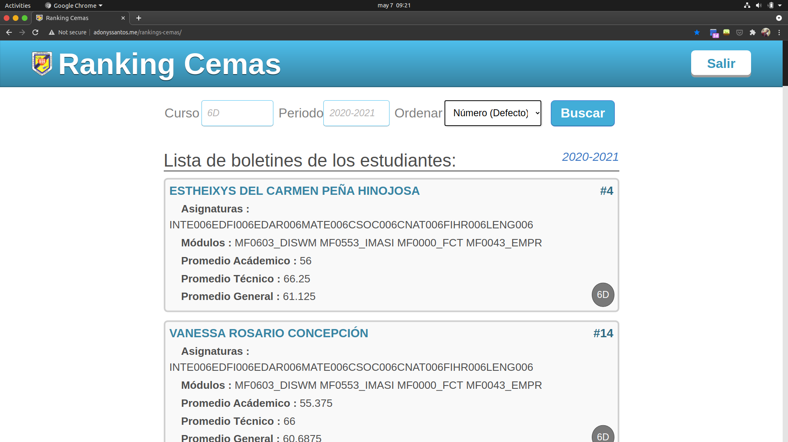

<p align="center">
	
</p>

<h2 align="center">Ranking Cemas</h2>

<p align="center">
	Este es un proyecto escolar, consiste en crear una App con React, Bootstrap y Firebase. Se requiere ordenar el listado de estudiantes según su calificación  y promedio. Estos datos son obtenidos de un JSON desde un reporte de los estudiantes del centro. 
</p>

## Tabla de contenido

- [Backlog](#backlog)
- [Captura de pantalla](#captura-de-pantalla)
- [Scripts](#scripts)
- [Peticion de los reportes](#peticion-de-los-reportes)
- [Colaboradores de este proyecto](#colaboradores-de-este-proyecto)
## Backlog

- Debe mostrar el listado de estudiantes. 
- Debe tener una barra de búsqueda para filtrar los estudiantes por curso.
- Debe tener una barra de búsqueda para filtrar los estudiantes por periodo.
- Debe tener una barra de búsqueda para filtrar los estudiantes por índice.
- Debe mostrar el listado de estudiantes con su índice académico.
- Debe mostrar el listado de estudiantes con su índice técnico.
- Debe mostrar el listado de estudiantes con su índice general.
- Debe ordenar el listado de estudiantes según su número de lista.
- Debe ordenar el listado de estudiantes según su índice académico.
- Debe ordenar el listado de estudiantes según su índice técnico.
- Debe ordenar el listado de estudiantes según su índice general.
- Debe obtener la información desde la base de datos del centro educativo. 
- Debe contar con un sistema de inicio de sesión para saber quien usa esta app.

## Captura de pantalla



## Scripts

En este proyecto puedes correr los siguientes Scripts:

### `npm install`

Para instalar los módulos necesarios de Node.

### ``npm start``

Ejecuta la aplicación en el modo de desarrollo. \
Abra [http://localhost:3000](http://localhost:3000) para visualizarlo en el navegador.

La página se recargará si realiza modificaciones. \
También verá cualquier error por la consola.

### `npm run predeploy`

Construye la aplicación para producción en la carpeta `build`. \
Agrupa correctamente React en el modo de producción y optimiza la compilación para obtener el mejor rendimiento.

La compilación se minimiza y los nombres de archivo incluyen los hash. \
¡Tu aplicación está lista para salir a producción!

Para mas información visita la sección [deployment](https://facebook.github.io/create-react-app/docs/deployment). 

### `npm run deploy`

Publica la aplicación usando GH Pages.

## Peticion de los reportes 

El primer paso del algoritmo es obtener los reportes por curso y periodo. Por ejemplo `4A:2020-2021`.

La siguiente funcion nos sirve para formar la URL para el pedido de reportes: 

**`getReportsURL.js`**
 ```js
 const getReportsURL = (curso, periodo) => {

	/**
	 * @description: Obtener todos los reportes por curso y periodo. 
	 * @param	{String}	curso Ejemplo: "4A"
	 * @param	{String}	Periodo Ejemplo: "2020-2021"
	 * @URL https://cemasapi.herokuapp.com/reportes/boletin/4A:2020-2021:
	 * @return  {String}	URL	 String URL .
	 */
// code...

};

```

El hook para gestionar los fecth al API es:

**`useFetch.js`**
```js
import { useState, useEffect, useRef } from 'react';

export const useFetch = (url) => {
	// code
}

```

El componente que hace la peticion y usa el useFetch:

**`ListaBoletines.js`**
```js
import { useFetch } from "../hooks/useFetch";
import ItemBoletin from "./ItemBoletin";


export default function ListaBoletines({ url }) {
// code...
}

```

## Colaboradores de este proyecto

- [Adonys Santos ](https://github.com/adonyssantos) (Product Owner + Developer)
- [Rusbert Sánchez](https://github.com/Rusbert8) (Product Owner + Developer)
- [Yusset Roque Martinez ](https://github.com/YussetRoque) (Developer)
- [Leidy Laura ](https://github.com/leidylauraverasveras) (Developer)
- [Gregory Pimentel ](https://github.com/Gregorypimentel) (Developer)
