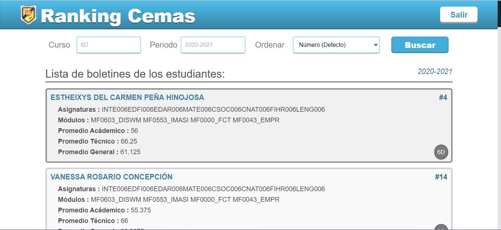

<p align="center">
	
</p>

<h2 align="center">Ranking Cemas</h2>

<p align="center">
	Este es un proyecto escolar, consiste en crear una App con React, Bootstrap y Firebase. Se requiere ordenar el listado de estudiantes según su calificación  y promedio. Estos datos son obtenidos de un JSON desde un reporte de los estudiantes del centro. 
</p>

## Backlog

- Debe mostrar el listado de estudiantes. 
- Debe tener una barra de búsqueda para filtrar los estudiantes por curso.
- Debe tener una barra de búsqueda para filtrar los estudiantes por periodo.
- Debe tener una barra de búsqueda para filtrar los estudiantes por índice.
- Debe mostrar el listado de estudiantes con su índice académico.
- Debe mostrar el listado de estudiantes con su índice técnico.
- Debe mostrar el listado de estudiantes con su índice general.
- Debe ordenar el listado de estudiantes según su número de lista.
- Debe ordenar el listado de estudiantes según su índice académico.
- Debe ordenar el listado de estudiantes según su índice técnico.
- Debe ordenar el listado de estudiantes según su índice general.
- Debe obtener la información desde la base de datos del centro educativo. 
- Debe contar con un sistema de inicio de sesión para saber quien usa esta app.

## Proyecto Terminado.



## Scripts.

En este proyecto puedes correr los siguientes Scripts:

### `yarn install` o `npm install`

Para instalar los módulos necesarios de Node.

### `yarn start` o ``npm start``

Ejecuta la aplicación en el modo de desarrollo. \
Abra [http://localhost:3000](http://localhost:3000) para visualizarlo en el navegador.

La página se recargará si realiza modificaciones. \
También verá cualquier error por la consola.

### `yarn run predeploy` o `npm run predeploy`

Construye la aplicación para producción en la carpeta `build`. \
Agrupa correctamente React en el modo de producción y optimiza la compilación para obtener el mejor rendimiento.

La compilación se minimiza y los nombres de archivo incluyen los hash. \
¡Tu aplicación está lista para salir a producción!

Para mas información visita la sección [deployment](https://facebook.github.io/create-react-app/docs/deployment). 

### `yarn run deploy` o `npm run deploy`

Publica la aplicación usando GH Pages.

<!-- 
## Firebase

Aquí va la explicación de como conectar la DB. 
-->

 ## El primer paso del algoritmo es obtener los reportes por curso y periodo:      
 `4A:2020-2021`
 
 ### Para llevar acabo la peticion de los reportes debemos usar: 
 #### La funcion para crear la URL que solicita los reportes al API: 

 La siguiente funcion nos sirve para formar la URL para el pedido de reportes: 
 ```js
 const getReportsURL = (curso, periodo) => {

	/**
	 * @description: Obtener todos los reportes por curso y periodo. 
	 * @param	{String}	curso Ejemplo: "4A"
	 * @param	{String}	Periodo Ejemplo: "2020-2021"
	 * @URL https://cemasapi.herokuapp.com/reportes/boletin/4A:2020-2021:
	 * @return  {String}	URL	 String URL .
	 */
...
};
 ```
 El hook para gestionar los fecth al API es:

`useFetch`
```js
import { useState, useEffect, useRef } from 'react';


export const useFetch = (url) => {
...
}
```

 El componente que hace la peticion y usa el useFetch:

```js
import { useFetch } from "../hooks/useFetch";
import ItemBoletin from "./ItemBoletin";


export default function ListaBoletines({ url }) {
...
}
```

## Colaboradores de este proyecto:

- [Adonys Santos (Product Owner + Developer)](https://github.com/adonyssantos)
- [Rusbert Sánchez](https://github.com/Rusbert8) (Product Owner + Developer)
- [Yusset Roque Martinez (Developer)](https://github.com/YussetRoque)
- [Leidy Laura (Developer)](https://github.com/leidylauraverasveras)
- [Gregory Pimentel (Developer)](https://github.com/Gregorypimentel)
- [ ()]()

