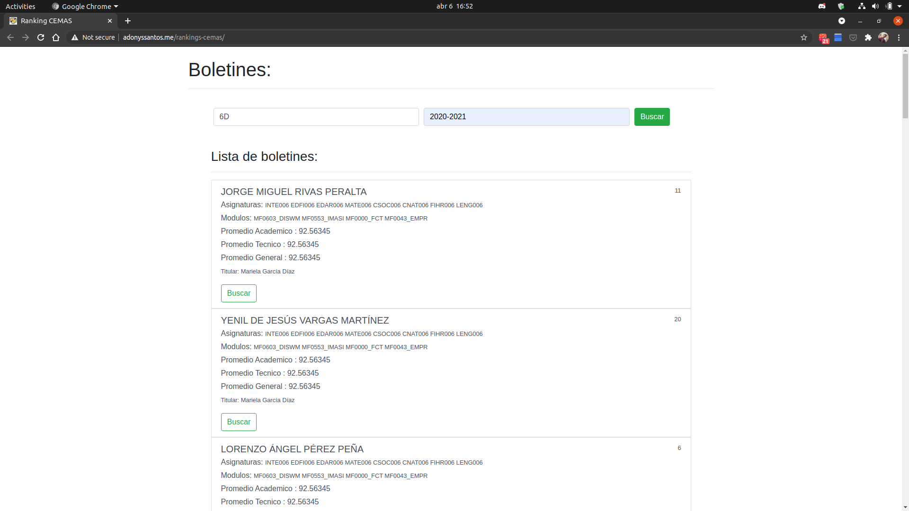

# Introducción

Este es un proyecto escolar grupal, que consiste en crear una App con React, Bootstrap y Firebase. Se requiere ordenar el listado de estudiantes según su calificación promedio. Todos estos datos son obtenidos desde un JSON con un reporte de los estudiantes del centro.

Este proyecto esta hecho con [Create React App](https://github.com/facebook/create-react-app).


Link de los reportes del proyecto [Reportes](https://drive.google.com/drive/folders/1sJdno7Qg00N_rRsHNCbQpDaTjWBCEIAA).


## Capturas de pantalla



# De que trata esta aplicación:

Esta app se trata o se basa en poder sacar **promedio a las calificaciones**, esta calcula los **índices académico ,**también las calificaciones generales** y las técnicas**  de cada uno los estudiantes del centro y contara demostrar la lista de los estudiantes por el Bom ordenado según las calificación con un estilo simple. 

# Como lo hacemos :

Nuestra app **RANKING CEMAS** se realiza de una forma fácil, nosotros buscamos la forma de programar cada cosa y buscar los códigos y programas necesarios para que nos pudiera ir funcionando.


 # Esta hace lo siguiente:
  
*ordenar el listado de estudiantes según su numero de listado.*
*ordenar el listado de estudiantes según su índice académico.*

## Que contiene la app:

* Lista de estudiante.
* Tiene una barra de búsqueda para filtrar los estudiantes por curso.
* Tiene una barra de búsqueda para filtrar los estudiantes por periodo.
* Tiene una barra de búsqueda para filtrar los estudiantes por índice.
* Muestra el listado de estudiantes con su índice académico.
* Muestra el listado de estudiantes con su índice técnico.
* Muestra el listado de estudiantes con su índice general. 
* Ordena el listado de estudiantes según su índice general.
* Obtiene la información desde base de datos del centro educativo. 
* Cuenta con un sistema de inicio de sesión.
* Evitar que personas externas al centro accedan a la información.

## Ventajas:

* Mas facibilidad a los maestros.
* Las calificaciones salen correctamente.
* Menos duración al sacar el una calificación o un promedio.
* Acto para todos los centros educativos.
* Solos los del centro podrán tomar información de la app.
* Bien elaborado.

## Desventajas

 * La app puede ser hackeada para tomar información.
* El sistema puede caerse después de un tiempo.

 ## Beneficios
 
 Esta es una app que todos los estudiantes y maestros podremos utilizar con la fasibilidad de poder adquirir y poner las calificaciones, con esta app no tendremos que ver en una hoja que calificación tenemos solo entrar a la pagina y ver cual es tu calificación, se le ara mas fácil a los maestro porque solo tendrán que poner los numero y directamente le mandara la calificación y promedio.
 
## Scripts

En este proyecto puedes correr los siguientes Scripts:

### `yarn install` o `npm install`

Para instalar los módulos necesarios de Node.

### `yarn start` o ``npm start``

Ejecuta la aplicación en el modo de desarrollo. \
Abra [http://localhost:3000](http://localhost:3000) para visualizarlo en el navegador.

La página se recargará si realiza modificaciones. \
También verá cualquier error por la consola.

### `yarn run predeploy` o `npm run predeploy`

Construye la aplicación para producción en la carpeta `build`. \
Agrupa correctamente React en el modo de producción y optimiza la compilación para obtener el mejor rendimiento.

La compilación se minimiza y los nombres de archivo incluyen los hash. \
¡Tu aplicación está lista para salir a producción!

Para mas información visita la sección [deployment](https://facebook.github.io/create-react-app/docs/deployment). 

### `yarn run deploy` o `npm run deploy`

Publica la aplicación usando GH Pages.

<!-- 
## Firebase

Aquí va la explicación de como conectar la DB. 
-->

## Contribución

1. Crea un Fork del repositorio.
2. Clonar en tu maquina mediante `git clone url_del_repositorio_fork`.
3. Crear una nueva rama con el nombre de tu feature.
4. Realiza tus cambios.
5. Manda tu pull request a la rama `pre-production`.

## Mantener actualizado tu Fork

Una vez tenga clonado el repositorio Fork en tu PC, lo primero que tienes que hacer es crear un remoto al repositorio principal usando: `git remote add upstream https://github.com/adonyssantos/rankings-cemas.git`. **(Esto solo lo tienes que hacer una vez).**

Luego cada vez que se haga un cambio en el repositorio principal y lo quieras traer a tu fork usa los siguientes comandos:

1. `git pull upstream main`
2. `git push origin main`

**Nota:** recuerda estar ubicado dentro de la rama que quieres actualizar.

Aquí unos enlaces con información que podria serte util:
1. https://docs.github.com/en/github/collaborating-with-issues-and-pull-requests/configuring-a-remote-for-a-fork#platform-linux
2. https://docs.github.com/en/github/collaborating-with-issues-and-pull-requests/syncing-a-fork#platform-linux

 ## El primer paso del algoritmo es obtener los reportes por curso y periodo:      
 `4A:2020-2021`
 
 ### Para llevar acabo la peticion de los reportes debemos usar: 
 #### La funcion para crear la URL que solicita los reportes al API: 
 La siguiente funcion nos sirve para formar la URL para el pedido de reportes: 
 ```js
 const getReportsURL = (curso, periodo) => {

	/**
	 * @description: Obtener todos los reportes por curso y periodo. 
	 * @param	{String}	curso Ejemplo: "4A"
	 * @param	{String}	Periodo Ejemplo: "2020-2021"
	 * @URL https://cemasapi.herokuapp.com/reportes/boletin/4A:2020-2021:
	 * @return  {String}	URL	 String URL .
	 */
...
};
 ```
 
#### El hook para gestionar los fecth al API:

El hook que creamos es `useFetch`
```js
import { useState, useEffect, useRef } from 'react';


export const useFetch = (url) => {
...
}
```

#### El componente que hace la peticion y usa el useFetch:

```js
import { useFetch } from "../hooks/useFetch";
import ItemBoletin from "./ItemBoletin";


export default function ListaBoletines({ url }) {
...
}
```
